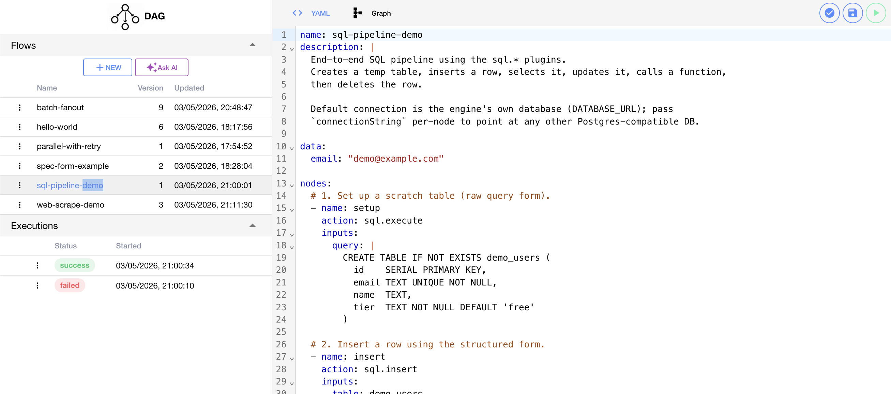

# DAISY Workflow Engine

This project is a modular workflow engine where workflows are defined as DAGs (Directed Acyclic Graphs).

Each workflow is defined using a simple YAML-based DSL, can be visually designed, and is executed by a runtime engine that manages dependencies, scheduling, and node execution.

[more docs here](./wiki/README.md)

## Features

### Triggers
- Email (SMTP)
- Scheduled triggers (cron-like)
- MQTT events
- Webhook triggers

### Node Types

#### Core
- [Condition](./tutorials/plugins/condition.md)
- [Delay](./tutorials/plugins/delay.md)
- [Transform](./tutorials/plugins/transform.md)
- [Log](./tutorials/plugins/log.md)

#### File System
- [Read](./tutorials/plugins/file_read.md)
- [Write](./tutorials/plugins/file_write.md)
- [List](./tutorials/plugins/file_list.md)
- [Stat](./tutorials/plugins/file_stat.md)
- [Delete](./tutorials/plugins/file_delete.md)

#### CSV
- [Read](./tutorials/plugins/csv_read.md)
- [Write](./tutorials/plugins/csv_write.md)

#### Excel
- [Read](./tutorials/plugins/excel_read.md)
- [Write](./tutorials/plugins/excel_write.md)

#### Network
- [HTTP requests](./tutorials/plugins/http_request.md)
- [Web scraping](./tutorials/plugins/web_scrape.md)

#### Database
- [Select](./tutorials/plugins/sql_select.md)
- [Insert](./tutorials/plugins/sql_insert.md)
- [Update](./tutorials/plugins/sql_update.md)
- [Delete](./tutorials/plugins/sql_delete.md)
- [Execute queries](./tutorials/plugins/sql_execute.md)

---

## Screenshots

---

## License

Personal project — can be adapted or reused with attribution.

---

Built as a personal exploration of workflow engines, automation systems, and DAG-based execution models.

 
