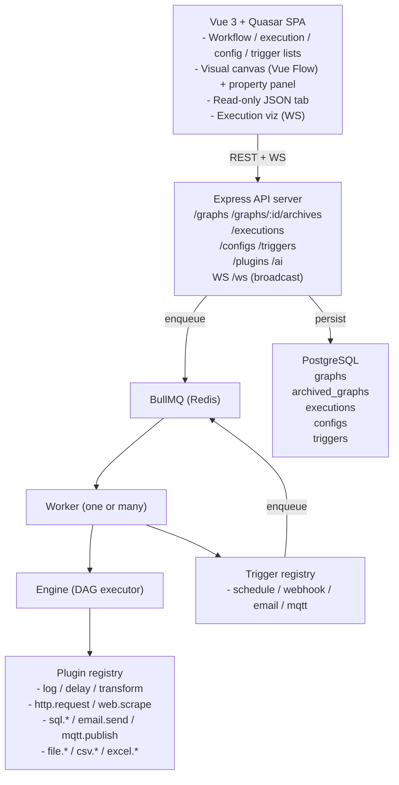

# Architecture

## High-level component diagram



## Execution algorithm

1. **Load & validate** — fetch the graph row, prefer the `parsed` JSONB cache, otherwise re-parse the `dsl` JSON. Validate against the JSON schema, check that every `edge.from`/`edge.to` resolves to a node, and run a Kahn's-algorithm cycle check.
2. **Build the DAG** — produce an in-memory adjacency list and an indegree map.
3. **Initialise context** — `ctx = { ...data, ...userInput, nodes: {}, config: {...decryptedConfigs}, env: {...envProjection} }`. Every `${...}` placeholder is evaluated against this context. Pure paths (`${nodes.fetch.output.body.title}`) take a fast lane through a tiny resolver; richer expressions are passed to the FEEL evaluator (`feelin`) with helpers (`toJson`, `parseJson`, `toJsonPretty`) injected.
4. **Schedule layer-by-layer** —
   - Pop every node whose `indegree === 0` into the *ready set*.
   - Run them in parallel with `Promise.allSettled`.
   - Each node:
     1. Resolves `executeIf`. If false → status `skipped`, and the engine cascades `skipped` to descendants reachable only through this node (parallel branches that meet downstream still get a chance).
     2. Detects `batchOver` → resolves to an array → fan-out, collect per-item results into `{ items: [...], count: N }`.
     3. Calls the plugin with the resolved input.
     4. On error: retry up to `retry` with `retryDelay`. If still failing, look at `onError`:
        - `continue` → status `failed`, downstream nodes still receive the failure flag and run.
        - `terminate` (default) → engine aborts; remaining nodes are marked `skipped`.
   - After settling, decrement indegree of every successor and add newly-ready successors to the next layer.
5. **Persist** — every node's lifecycle event (`started`, `succeeded`, `failed`, `skipped`, `retrying`) is appended to `backend/logs/node-events.log` (JSONL) and broadcast on the WebSocket as `{ executionId, node, status, at, output?, error? }`. The post-run summary lands on `executions.context.nodes`.
6. **Finalise** — the execution row gets `status` (`success` | `failed` | `partial`) + `finished_at` + the redacted `context` (with `config` and `env` stripped — secrets never round-trip into the table).

## Plugin contract

A plugin is a plain object:

```js
export default {
  name: "http.request",
  description: "Performs an HTTP request via fetch and returns status + body.",
  inputSchema:  { /* JSON Schema */ },
  primaryOutput: "body",
  outputSchema: { /* JSON Schema */ },
  async execute(input, ctx) { /* return output object */ },
};
```

The registry validates input against `inputSchema` before invoking `execute`. `primaryOutput` is the key on the returned object that the engine writes to `ctx[outputVar]` when the node-level `outputVar` is set. The frontend's property panel renders inputs straight off `inputSchema` (with custom keywords `title`, `format: "textarea"`, `placeholder`) and the Returns panel off `outputSchema`.

Plugins live in `backend/src/plugins/builtin/` and are auto-loaded on startup.

## Configurations

`backend/src/configs/` holds the typed configuration system:

- **registry** — defines each `type` (mail.smtp, mail.imap, mqtt, database, generic) with its fields, required flags, and which fields are `secret`.
- **crypto** — AES-256-GCM helpers keyed by SHA-256(`CONFIG_SECRET`). Encrypted values are stored as `{ __enc: true, v: "<base64 iv|tag|ciphertext>" }`, distinguishable from plain strings on read-back. Without `CONFIG_SECRET`, a deterministic dev key is used and a one-time warning is logged.
- **loader** — `loadConfigsMap()` reads every config row, decrypts secrets, and returns `{ <name>: { <field>: <plainValue> } }`. `buildConfigEnv(map)` flattens the same data into env-var-shaped keys (`CONFIG_<NAME>_<FIELD>`).

The worker injects both shapes (`ctx.config`, `ctx.env`) at execution start and strips them before persisting `executions.context`.

## Triggers

`backend/src/triggers/` mirrors the plugin architecture but for event sources:

- **registry** — auto-loads drivers from `triggers/builtin/`. Each driver exports `{ type, configSchema, async subscribe(config, onFire) }`.
- **manager** — on worker boot, lists every enabled `triggers` row, looks up its driver, and calls `subscribe` to start listening. `onFire(payload)` enqueues a workflow execution with the payload as the user-supplied input.
- Built-in drivers: `schedule` (croner cron + interval), `webhook` (HTTP endpoint at `/webhooks/:id`), `email` (IMAP IDLE via imapflow), `mqtt` (broker subscribe via mqtt.js, sharing the same connection cache as `mqtt.publish`).

## Database schema (summary)

```
graphs(id PK, name, dsl TEXT, parsed JSONB, created_at, updated_at, deleted_at)
   - PARTIAL UNIQUE(name) WHERE deleted_at IS NULL  (single-row-per-flow)

archived_graphs(id PK, source_id FK→graphs.id, name, dsl, parsed, reason, archived_at)
   - explicit user-initiated snapshots; ON DELETE CASCADE removes them with the graph

executions(id PK, graph_id FK, status, inputs JSONB, context JSONB,
           started_at, finished_at, created_at, error TEXT)

configs(id PK, name UNIQUE, type TEXT, data JSONB, created_at, updated_at)

triggers(id PK, name, graph_id FK, type, config JSONB, enabled BOOL,
         created_at, updated_at)
```

Per-node history is no longer in Postgres — the post-run summary lives on `executions.context.nodes`, and the JSONL event log under `backend/logs/` carries the full lifecycle.

## Scaling

- **Workers are stateless** — run as many `node src/worker.js` processes as you need. BullMQ handles fair-share dispatch.
- **Trigger manager affinity** — triggers are subscribed in-worker. For a multi-worker deployment you'll typically run a single worker process responsible for triggers (set per-host, since IMAP / MQTT subscriptions don't tolerate duplication well) plus N additional workers that only process queue jobs.
- **WebSocket fan-out** — each API process subscribes to a Redis pub/sub channel and forwards execution events to its connected clients, so any worker can update any client.
- **Hot-reload of plugins** — `backend/src/plugins/builtin/` is picked up by `--watch` in dev.
