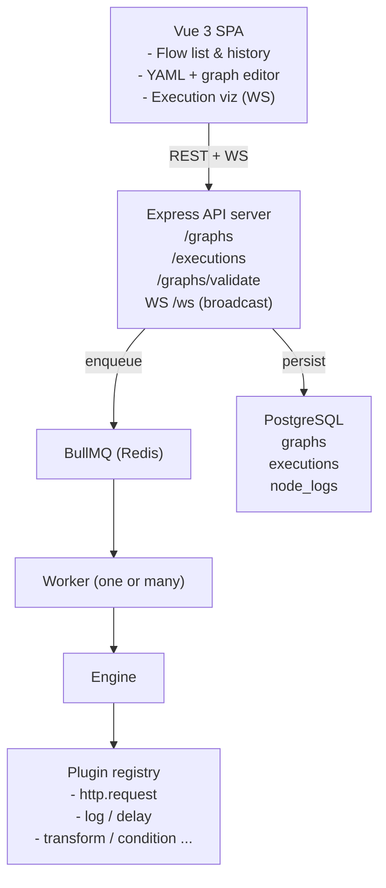

# Architecture

## High-level component diagram


 
## Execution algorithm

1. **Load & validate** — fetch the graph row, parse YAML, validate against the JSON schema, check that every `edge.from`/`edge.to` resolves to a node, and run a DFS cycle check (Kahn's algorithm).
2. **Build the DAG** — produce an in-memory adjacency list and an indegree map.
3. **Initialize context** — `ctx = { data, nodes: {}, env: {} }` (frozen prototype). Every expression `${...}` is resolved against this context with a sandboxed evaluator (no `eval` — a tiny path resolver + arithmetic via `expr-eval`).
4. **Schedule layer-by-layer** —
   - Pop every node whose `indegree === 0` into the *ready set*.
   - Run them in parallel with `Promise.allSettled`.
   - Each node:
     1. Resolves `executeIf`. If false → status `skipped`, downstream still proceeds.
     2. Detects batch input (any input value is an array marked with `$batch: true` or the node declares `batch: true`) → fan-out, collect results into an array.
     3. Calls the plugin with the resolved input.
     4. On error: retry up to `retry` with `retryDelay`. If still failing, look at `onError`:
        - `continue` → status `failed`, downstream nodes still receive the failure flag and run.
        - `terminate` (default) → engine aborts; remaining nodes are marked `skipped`.
   - After settling, decrement indegree of every successor and add newly-ready successors to the next layer.
5. **Persist** — every node's lifecycle event (`started`, `succeeded`, `failed`, `skipped`, `retrying`) is written to `node_logs` and broadcast on the WebSocket as `{ executionId, node, status, at, output?, error? }`.
6. **Finalize** — execution row gets `status` (`success` | `failed` | `partial`) + `finishedAt`.

## Plugin contract

A plugin is a plain object:

```js
export default {
  name: "http.request",
  inputSchema: { /* JSON schema */ },
  outputSchema: { /* JSON schema */ },
  async execute(input, ctx) { /* return output object */ }
}
```

The registry validates input against `inputSchema` before invoking `execute`, and validates the returned object against `outputSchema`. Plugins live in `backend/src/plugins/builtin/` and are auto-loaded on startup; users can also drop a file into `backend/plugins-extra/` (auto-loaded if present).

## Database schema (summary)

```
graphs(id PK, name, version, yaml, parsed JSONB, created_at, updated_at, deleted_at)
   - UNIQUE(name, version) so updates bump version

executions(id PK, graph_id FK, status, context JSONB, started_at, finished_at, error TEXT)

node_logs(id PK, execution_id FK, node_name, status, attempt INT, input JSONB, output JSONB,
          error TEXT, started_at, finished_at)
```

## Scaling

- **Workers are stateless** — run as many `node src/worker.js` processes as you need. BullMQ handles fair-share dispatch.
- **WebSocket fan-out** — each API/worker publishes to a Redis pub/sub channel; the API processes subscribe and forward to connected clients (so any worker can update any client).
- **Hot-reload of plugins** — `backend/plugins-extra/` is watched in dev.
